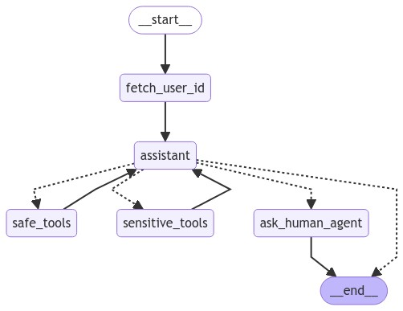

A bot that helps route the user to their required cleaning service. Alternatively, for services we don't have any information for, it informs them that they are being redirected to a human agent.

Add your OpenAI and Langchain API keys to the `.env.example` file and rename it to `.env`.

I've used Poetry for package management, so once poetry is installed on your system, running `poetry install --no-root` will install all the requirements.

## How to use
Firstly, you'll have to generate the database of availabilities and bookings. To do this, run `poetry run python database.py`. this will generate `availabilities.sqlite` and `bookings.sqlite`.

Running `poetry run uvicorn app:app --reload` will start a uvicorn server. You can send a POST request to `http://127.0.0.1:8000/chatbot`, with a schema as such: `{"content": str, "user_id": str}` and the bot will send back a response with the schema: `{"response": str}`.

You can directly use the docs page that opens on localhost or use interfaces like Postman to send this POST request.

You could also start a local gradio app by running `poetry run python grinterface.py` and then chat with the agent that way. The gradio interface is a WIP and might crash out with some interactions.

Aside: `poetry run pre-commit install` will make sure the pre-commit hooks run to accomplish all the tasks like linting, typechecking, etc. You can also run those checks manually with `poetry run pre-commit run --all-files`. You can add more pre-commit checks by adding hooks to the `.pre-commit-config.yaml` file.

I checked out a few of the currently popular multi-ai-agent frameworks (CrewAI, LangGraph, AutoGen) to see what fit this particular task. You can find some of those experimentations here:
- [GitHub: multi-agent-ai](https://github.com/kevin-v96/multi-agent-ai)
- [GitHub: multi-agent-ai-tutorials](https://github.com/kevin-v96/multi-agent-ai-tutorials)

I found that out of the three that I tested, CrewAI has the simplest interface and lends itself to simple tasks such as this. Moreover, AutoGen and LangGraph add some (in my opinion) unneccesary complexity to their interface which makes it hard to scale them down for simple tasks (but they, especially LangGraph, are better for more complex tasks especially when it comes to human input interrupts).

## Evaluation
To run evals run `poetry run python red_teaming.py`. You can access the red teaming evaluation on [LangSmith](https://smith.langchain.com/public/e7fff5a8-6c3c-48f2-8fce-eb1439bbc864/d). As you can see there, our agent resisted the red teaming attempts with a success rate of 0.82, which is not bad for a start and tells us that our agent is worth iterating upon to work out the kinks.

## TO-DO
- [x] add thread id support for multi-user memory
- [x] Add FastAPI
- [x] Add Evaluations
- [x] Red-teaming the bot
### Longer-term TO-DOs
- [x] Add gradio interface
- [ ] Fix cancellation workflow - exact input to the tools
- [ ] Add containerization
- [ ] Add unit tests for the database tools
- [ ] More robust evaluations
### Proposed improvements
- [ ] More robust confirmation flow/user journey
- [ ] Add a CrewAI Crew as nodes in LangGraph (since CrewAI crews are Runnables)
- [ ] Divide the workflow into more specialised agents, which was not needed here since they can individually run into infinite recursions if the correct params are not set

## References
- [Creating a Multi-Agent Chatbot Using AutoGen: An End-to-End Guide](https://blog.arjun-g.com/creating-a-multi-agent-chatbot-using-autogen-an-end-to-end-guide-78b6671a96b4)
- [DeepLearning.ai - Multi AI Agent Systems with CrewAI](https://learn.deeplearning.ai/courses/multi-ai-agent-systems-with-crewai)
- [DeepLearning.ai - AI Agentic Design Patterns with AutoGen](https://learn.deeplearning.ai/courses/ai-agentic-design-patterns-with-autogen)
- [How to Build a SQL Agent with CrewAI and Composio](https://www.analyticsvidhya.com/blog/2024/07/sql-agent-with-crewai-and-composio/)
 - [CrewAI Docs](https://docs.crewai.com/)
 - [FastAPI Docs](https://fastapi.tiangolo.com/)
 - [LangGraph Docs](https://langchain-ai.github.io/langgraph/tutorials/customer-support/customer-support/)
 - [Pre-commit Docs](https://pre-commit.com/)
 - [LangServe Docs](https://python.langchain.com/v0.2/docs/langserve/)
 - [Example of using CrewAI and LangGraph together](https://github.com/crewAIInc/crewAI-examples/tree/main/CrewAI-LangGraph)
 - [Chatbot Evaluation](https://langchain-ai.github.io/langgraph/tutorials/chatbot-simulation-evaluation/agent-simulation-evaluation/)
