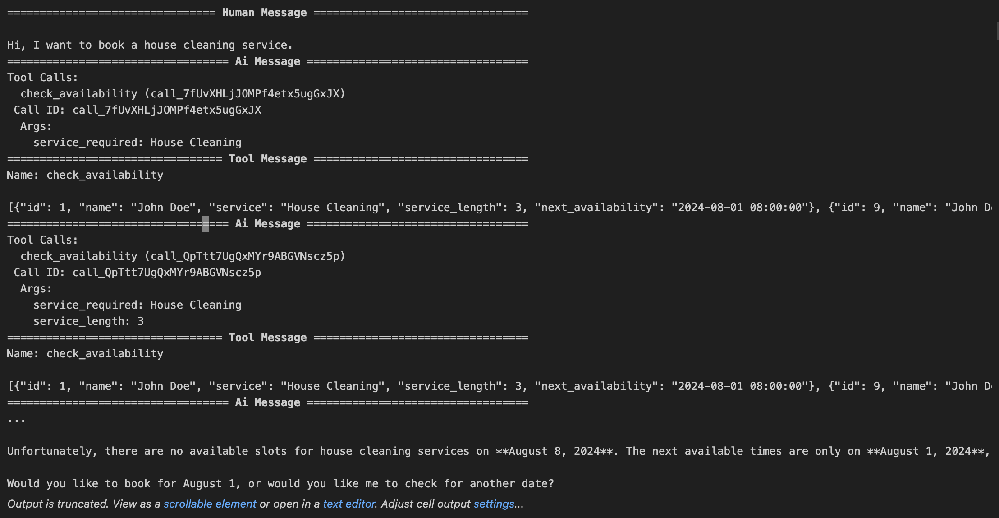

A bot with multiple agents written in CrewAI and LangGraph. It helps route the user to thei required cleaning service. Alternatively, for services we don't have any information for, it informs them that they are being redirected to a human agent.

I've used Poetry for package management, so once poetry is installed on your system, running `poetry install --no-root` will install all the requirements.

## Crew
 Running `poetry run python runcrew.py` will run the crew on the command line. I started out with a simple crew but found that it didn't have support for threads, which was a requirement for me.

## LangGraph
Running `poetry run python main.py` will run the chat with the LangGraph agent.

Aside: `poetry run pre-commit install` will make sure the pre-commit hooks run to accomplish all the tasks like linting, typechecking, etc. You can also run those checks manually with `poetry run pre-commit run --all-files`. You can add more pre-commit checks by adding hooks to the `.pre-commit-config.yaml` file.

I checked out a few of the currently popular multi-ai-agent frameworks (CrewAI, LangGraph, AutoGen) to see what fit this particular task. You can find some of those experimentations here:
- [GitHub: multi-agent-ai](https://github.com/kevin-v96/multi-agent-ai)
- [GitHub: multi-agent-ai-tutorials](https://github.com/kevin-v96/multi-agent-ai-tutorials)

I found that out of the three that I tested, CrewAI has the simplest interface and lends itself to simple tasks such as this. Moreover, AutoGen and LangGraph add some (in my opinion) unneccesary complexity to their interface which makes it hard to scale them down for simple tasks (but they, especially LangGraph, are better for more complex tasks especially when it comes to human input interrups).

## Example Runs
I'm adding some runs during development here:

## TO-DO
- [x] add thread id support for multi-user memory - this is only possible with LangGraph. Currently CrewAI doesn't seem to support multiple threads
- [x] Add example runs
- [ ] Add Evaluations
- [x] Add FastAPI
### Longer-term TO-DOs
- [ ] Add gradio interface
- [ ] Add the crew as nodes in a LangGraph graph
- [ ] Add containerization

## References
- [Creating a Multi-Agent Chatbot Using AutoGen: An End-to-End Guide](https://blog.arjun-g.com/creating-a-multi-agent-chatbot-using-autogen-an-end-to-end-guide-78b6671a96b4)
- [DeepLearning.ai - Multi AI Agent Systems with CrewAI](https://learn.deeplearning.ai/courses/multi-ai-agent-systems-with-crewai)
- [DeepLearning.ai - AI Agentic Design Patterns with AutoGen](https://learn.deeplearning.ai/courses/ai-agentic-design-patterns-with-autogen)
- [How to Build a SQL Agent with CrewAI and Composio](https://www.analyticsvidhya.com/blog/2024/07/sql-agent-with-crewai-and-composio/)
 - [CrewAI Docs](https://docs.crewai.com/)
 - [FastAPI Docs](https://fastapi.tiangolo.com/)
 - [LangGraph Docs](https://langchain-ai.github.io/langgraph/tutorials/customer-support/customer-support/)
 - [Pre-commit Docs](https://pre-commit.com/)
 - [LangServe Docs](https://python.langchain.com/v0.2/docs/langserve/)
 - [Example of using CrewAI and LangGraph together](https://github.com/crewAIInc/crewAI-examples/tree/main/CrewAI-LangGraph)
